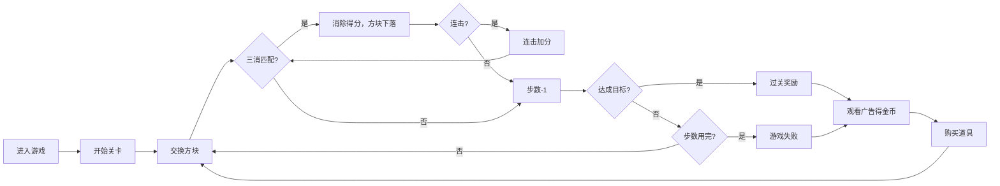

## 1. 产品概述

开心消消乐是一款休闲三消类网页游戏，集成广告激励机制。玩家通过交换相邻方块消除相同图案获得分数，观看广告可获得金币奖励，金币用于购买游戏道具增强体验。

- 核心玩法：经典三消玩法，操作简单易上手
- 广告变现：横幅广告 + 激励视频广告
- 目标用户：休闲游戏爱好者

## 2. 核心功能

### 2.1 功能模块
1. **游戏主界面**：游戏棋盘、分数显示、金币显示、关卡信息、剩余步数
2. **消除玩法**：三消匹配逻辑、方块下落填充、连击加分、动画特效
3. **广告系统**：顶部横幅广告位、激励视频广告按钮、观看广告得金币
4. **道具商店**：锤子道具（消除单个方块）、刷新道具（重排棋盘）
5. **关卡系统**：目标分数、步数限制、关卡进度、过关奖励

### 2.2 页面详情

| 页面名称 | 模块名称 | 功能描述 |
|-----------|-------------|---------------------|
| 游戏主界面 | 顶部信息栏 | 显示金币、分数、关卡、剩余步数 |
| 游戏主界面 | 广告横幅 | 顶部展示横幅广告位 |
| 游戏主界面 | 游戏棋盘 | 8x8 方块棋盘，点击交换相邻方块 |
| 游戏主界面 | 道具栏 | 锤子、刷新道具按钮及数量显示 |
| 游戏主界面 | 广告按钮 | 观看广告获得金币按钮 |
| 结算弹窗 | 过关/失败 | 显示结果、奖励金币、继续按钮 |

## 3. 核心流程

玩家进入游戏 → 开始当前关卡 → 交换相邻方块进行消除得分 → 消除后上方方块下落补充 → 步数用完判断是否达成目标 → 过关/失败 → 可观看广告获取金币 → 使用金币购买道具

## 4. 用户界面设计

### 4.1 设计风格
- **主色调**：糖果粉紫渐变背景，明亮活泼
- **辅色调**：6种不同颜色的糖果方块
- **按钮风格**：圆角渐变按钮，带阴影和悬浮效果
- **字体**：圆润可爱的卡通字体
- **图标风格**：emoji 风格的糖果图案

### 4.2 页面设计概述

| 页面名称 | 模块名称 | UI 元素 |
|-----------|-------------|-------------|
| 游戏主界面 | 顶部信息栏 | 金币图标+数字、分数、关卡、步数进度条 |
| 游戏主界面 | 广告横幅 | 950x90 广告位，边框圆角 |
| 游戏主界面 | 游戏棋盘 | 8x8 网格，彩色糖果方块，选中高亮 |
| 游戏主界面 | 道具栏 | 锤子、刷新图标按钮，数量角标 |
| 游戏主界面 | 广告按钮 | 金色渐变按钮，播放图标 |
| 结算弹窗 | 结果展示 | 大标题、星星评分、奖励金币动画 |

### 4.3 响应式
- 桌面端优先，自适应移动端
- 棋盘大小自适应屏幕宽度
- 触摸操作优化

### 4.4 动画效果
- 方块消除：缩放+淡出动画
- 方块下落：缓动下落动画
- 得分弹出：数字上浮淡出
- 按钮点击：缩放反馈
- 过关庆祝：彩带粒子效果
