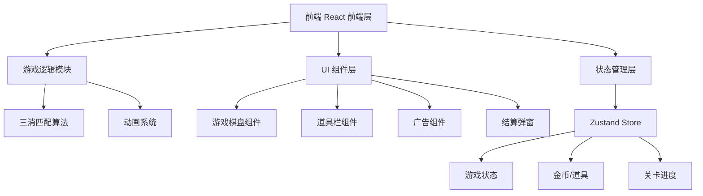

## 1. 架构设计



## 2. 技术描述

- **前端**：React@18 + TypeScript + Vite
- **样式**：TailwindCSS@3
- **状态管理**：Zustand
- **初始化工具**：vite-init
- **后端**：无（纯前端游戏）
- **数据存储**：localStorage 本地存储金币、关卡进度

## 3. 目录结构

```
src/
├── components/
│   ├── GameBoard.tsx      # 游戏棋盘
│   ├── CandyBlock.tsx     # 糖果方块
│   ├── TopBar.tsx          # 顶部信息栏
│   ├── ToolBar.tsx        # 道具栏
│   ├── AdBanner.tsx       # 广告组件
│   └── ResultModal.tsx   # 结算弹窗
├── hooks/
│   └── useGameLogic.ts     # 游戏逻辑 Hook
├── store/
│   └── useGameStore.ts  # 游戏状态 Store
├── utils/
│   └── gameUtils.ts       # 游戏工具函数
├── App.tsx
├── main.tsx
└── index.css
```

## 4. 核心数据结构

### 4.1 游戏状态
```typescript
interface GameState {
  board: CandyType[][];      // 8x8 棋盘
  score: number;           // 当前分数
  targetScore: number;   // 目标分数
  moves: number;         // 剩余步数
  level: number;         // 当前关卡
  coins: number;         // 金币数量
  selectedCell: {row: number, col: number} | null;  // 选中的格子
  isAnimating: boolean;  // 是否正在动画
  gameStatus: 'playing' | 'won' | 'lost';   // 游戏状态
}
```

### 4.2 道具类型
```typescript
interface ToolType = 'hammer' | 'refresh';
```

### 4.3 糖果类型
```typescript
type CandyType = 0 | 1 | 2 | 3 | 4 | 5;  // 6种糖果
```

## 5. 核心算法

### 5.1 三消匹配
- 遍历棋盘，检查水平和垂直方向连续3个及以上相同糖果
- 标记匹配的糖果位置
- 消除后上方糖果下落，顶部补充新糖果
- 连锁检测直到没有新的匹配

### 5.2 交换验证
- 交换两个相邻糖果
- 检查交换后是否产生匹配
- 若无匹配则交换回去

## 6. 广告集成

- 顶部横幅广告：950x90，使用用户提供的广告脚本
- 激励视频广告：点击按钮模拟观看，观看完成奖励金币（50金币/次）
- 广告脚本通过 document.write 方式注入
